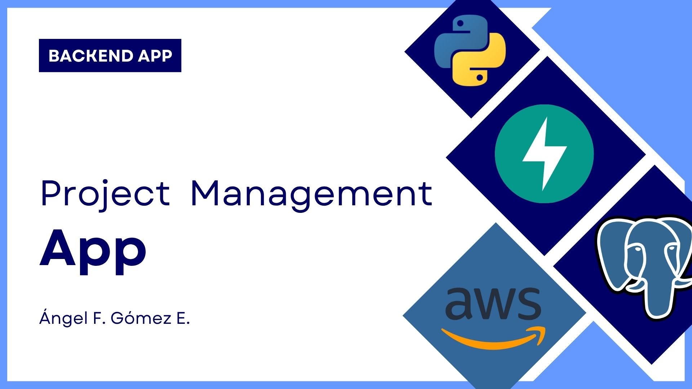

# 🧩 Project Management - Backend App

[](https://github.com/Ango1415/final-backend-project/actions)


---

## 🎥 Explanatory video

Link: https://www.youtube.com/watch?v=Z0HvLqmMM3g

---

## 📋 Overview

This project demonstrates my skills in **Python web backend development** using **FastAPI**.  
It’s a **project management API** where users can create, update, and share projects, attach documents, and collaborate with other participants.

Each project includes:
- A **name** and **description**.  
- **Documents** attached to it (e.g., `.pdf`, `.docx`).  
- A **user collaboration system** with roles (Owner and Participant).

---

## ⚙️ Tech Stack

| Component | Technology |
|------------|-------------|
| **Language** | Python 3.10 |
| **Backend Framework** | FastAPI |
| **Database** | PostgreSQL + SQLAlchemy |
| **Storage** | AWS S3 |
| **Serverless Functions** | AWS Lambda |
| **Containerization** | Docker |
| **Dependency Management** | Poetry |
| **Testing** | Pytest & Tox |
| **CI/CD** | GitHub Actions |

---

## 🚀 Features

- 🔐 **JWT Authentication** — secure login, tokens expire in 1 hour.  
- 📁 **Project Management** — create, update, delete, and list projects.  
- 📄 **Document Handling** — upload, update, and delete files stored on AWS S3.  
- 👥 **User Collaboration** — invite users as project participants.  
- ☁️ **AWS Lambda Integration** — handles file size computation and limits.  
- 🧪 **Automated Testing** — includes Pytest & Tox integration.  
- ⚙️ **CI/CD Ready** — with GitHub Actions pipeline configuration.

---

## 🧩 API Endpoints

| Method | Endpoint | Description |
|--------|-----------|-------------|
| `POST` | `/auth` | Register a new user |
| `POST` | `/login` | Authenticate user and get JWT |
| `POST` | `/projects` | Create a new project |
| `GET` | `/projects` | List all projects accessible to the user |
| `GET` | `/project/{project_id}/info` | Retrieve project details |
| `PUT` | `/project/{project_id}/info` | Update project details |
| `DELETE` | `/project/{project_id}` | Delete a project (owner only) |
| `GET` | `/project/{project_id}/documents` | List project documents |
| `POST` | `/project/{project_id}/documents` | Upload new documents |
| `GET` | `/document/{document_id}` | Download a document |
| `PUT` | `/document/{document_id}` | Update a document |
| `DELETE` | `/document/{document_id}` | Delete a document |
| `POST` | `/project/{project_id}/invite?user=<login>` | Invite a user to collaborate |

---

## 🧠 Roles & Permissions

| Role | Permissions |
|------|--------------|
| **Owner** | Full control: can create, update, delete, and share projects. |
| **Participant** | Can edit and upload documents, but cannot delete the project. |

---

## 🧪 Example API Requests

### 🔐 Register a User
```bash
POST /auth
Content-Type: application/json
```
```json
{
  "login": "newuser",
  "password": "mypassword",
  "repeat_password": "mypassword"
}
```

### 🔑 Login
```bash
POST /login
Content-Type: application/json
```
```json
{
  "login": "newuser",
  "password": "mypassword"
}
```

### 🏗 Create a Project
```bash
POST /projects
Authorization: Bearer <JWT_TOKEN>
Content-Type: application/json
```
```json
{
  "name": "AI Research Platform",
  "description": "A backend for managing AI research documentation."
}
```

### 📎 Upload a Document
```bash
POST /project/1/documents
Authorization: Bearer <JWT_TOKEN>
Content-Type: multipart/form-data
```
```
file=@report.pdf
```

---

## 🐳 Installation & Setup

### Option 1: Using Docker (Recommended) / remember to add your AWS credentials.
```bash
# Clone the repository
git clone https://github.com/Ango1415/final-backend-project.git
cd final-backend-project

# Run the application
docker-compose up --build
```

### Option 2: Using Poetry (Local Environment) - you must to have installed PostgreSQL >= 18
```bash
# Clone the repository
git clone https://github.com/Ango1415/final-backend-project.git
cd final-backend-project

# Install dependencies
poetry install

# Run the FastAPI app
poetry run ./src/main.py
```

---

## 🧪 Testing

You can run all tests using either `pytest` or `tox`:

```bash
pytest
# or
tox
```

---

## 🔄 CI/CD

This project integrates **GitHub Actions** for:
- ✅ Linting & Testing  
- 🧱 Building the Docker image  
- ☁️ Deployment to cloud environments  

---

## 📦 Future Improvements
- 🎥 Add video demos explaining the system workflow.  
- 🧭 Include OpenAPI/Swagger API documentation examples.  
- 🧱 Add architectural diagrams for database and cloud integration.  
- 🧰 Expand test coverage with integration tests.

---

## 👨‍💻 Author

**Ángel Fabián Gómez Estupiñán**  
💼 [GitHub Profile](https://github.com/Ango1415)  
📧 Contact: *(angelfabge@gmail.com)*

> *“Code is like humor. When you have to explain it, it’s bad.” — Cory House* 😄
